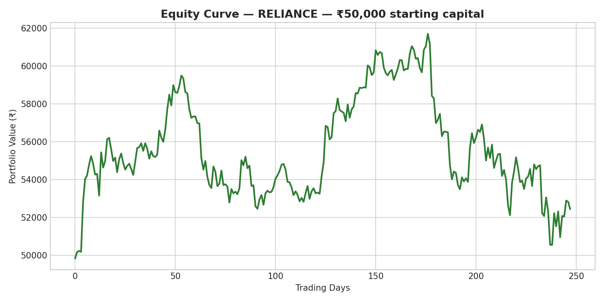
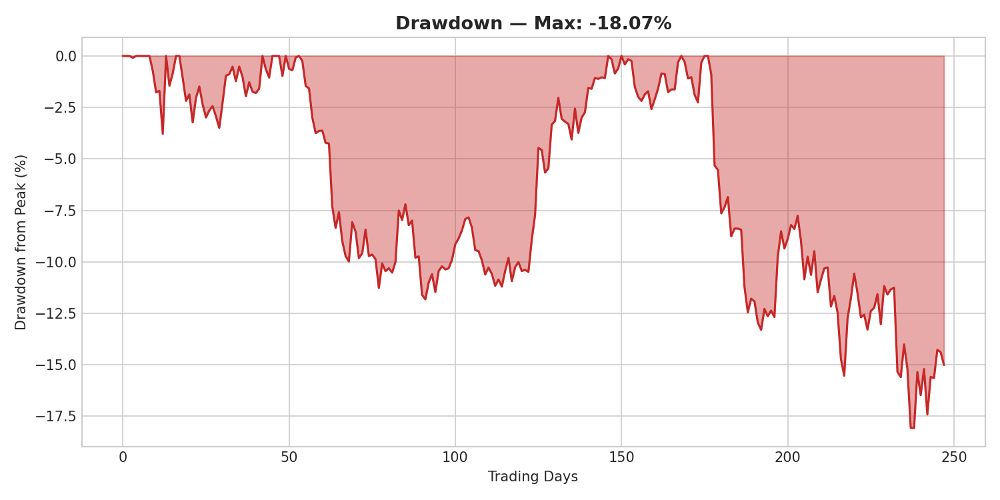
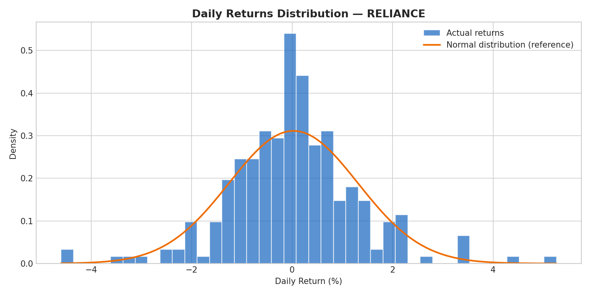
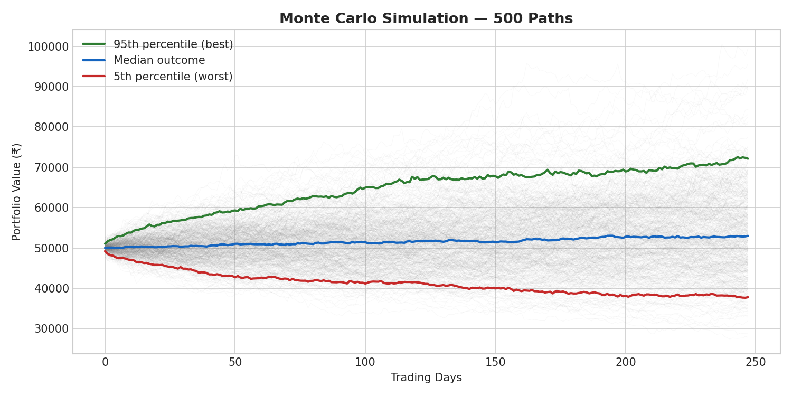

# Trading Statistics Analyzer

**Know if your trading strategy has a real edge — or if you've just been getting lucky.**

A statistical analysis engine for Indian equity strategies. Runs ten professional quant metrics on your trading data and gives you a single verdict: is this strategy worth real capital, or not?



---

## Who this is for

**Retail options and equity traders in India** who have at least six months of trade history and want to know — with real statistics, not gut feel — whether their edge is genuine or random.

**Trading educators** who teach strategies and want to validate them with rigorous numbers before publishing or selling courses.

**Small PMS analysts and prop desk researchers** who need fast Monte Carlo risk analysis and Sharpe/Sortino reporting without building the infrastructure from scratch.

If you've ever looked at your trading P&L and wondered *"is this skill or luck?"* — this tool answers that question.

---

## What it does

Ten institutional-grade statistical tests on any NSE equity or strategy return series:

- **Sharpe & Sortino Ratios** — risk-adjusted return, penalising only downside
- **Max Drawdown** — worst peak-to-trough loss in full equity history
- **Risk : Reward & Win Rate** — trade quality at a glance
- **Kelly Criterion (Half Kelly default)** — optimal position sizing
- **Hypothesis Testing (p-value)** — is your edge statistically real, or noise?
- **95% Confidence Intervals** — how confident we are about the true mean return
- **Distribution Analysis (skew & kurtosis)** — fat tails and crash risk detection
- **Monte Carlo Simulation (500 paths)** — worst-case scenarios and outcome ranges

Every metric comes with a plain-English verdict. No black boxes. All formulas in the code.

---

## Sample Output

Running the analyzer on one year of RELIANCE price data:







### Terminal Report

​```
════════════════════════════════════════════════════════════
  TRADING STATISTICS ANALYZER  |  NSE India
════════════════════════════════════════════════════════════
  Ticker   : RELIANCE
  Period   : 1y  (245 trading days)
  Capital  : ₹50,000

════════════════════════════════════════════════════════════
  1 & 2 │ SHARPE & SORTINO RATIOS
════════════════════════════════════════════════════════════
  Sharpe Ratio  : 0.142  ○ Weak
  Sortino Ratio : 0.218  (penalises downside only)

════════════════════════════════════════════════════════════
  3 │ MAX DRAWDOWN
════════════════════════════════════════════════════════════
  Max Drawdown  : -18.07%
  Worst Date    : 2026-03-27
  Final Equity  : ₹54,467.41

════════════════════════════════════════════════════════════
  11 │ MONTE CARLO (500 SIMULATIONS)
════════════════════════════════════════════════════════════
  Best case  (95th%): ₹    61,234.00
  Median            : ₹    54,467.00
  Worst case  (5th%): ₹    48,892.00
  Profitable paths  : 65.9%

════════════════════════════════════════════════════════════
  SUMMARY VERDICT
════════════════════════════════════════════════════════════
  Sharpe       : 0.14  ○
  Max Drawdown : -18.1%  ✓
  Edge (p<0.05): ○ Unconfirmed — more data needed
  Profitable MC: 66% of simulations

  ▶ OVERALL: Weak edge — trade small, monitor closely
​```

---

## Installation

Clone the repository and install the dependencies:

​```bash
git clone https://github.com/QuantShivam/trading-stats-analyzer.git
cd trading-stats-analyzer
pip install -r requirements.txt
​```

Run with defaults (RELIANCE, 1 year, ₹50,000 capital):

​```bash
python Trading-stats-analyzer.py
​```

Run on any NSE ticker, any period, any capital:

​```bash
python Trading-stats-analyzer.py --ticker TCS.NS --period 6mo
python Trading-stats-analyzer.py --ticker INFY.NS --capital 100000
python Trading-stats-analyzer.py --ticker HDFCBANK.NS --period 2y --capital 75000
​```

All four charts are saved automatically to `/images/` on every run.

---

## Run this on your own strategy

If you have your own trade history or a custom strategy and want this report run on your numbers — including the four charts — I can turn around a full statistical report in 48 hours.

**Email:** [shivam@quantshivam.com](mailto:shivam@quantshivam.com)
**LinkedIn:** [linkedin.com/in/-shivam-tyagi-](https://www.linkedin.com/in/-shivam-tyagi-/)

Send a CSV of your trade returns (daily or per-trade). I'll return a PDF report with all ten metrics, all four charts, and a plain-English verdict on whether your edge is statistically real.

---

## About the author

**Shivam Tyagi** — CMT Level I charterholder. Python developer focused on quantitative tools for Indian markets. Available for freelance work on data automation, backtesting, and trading analytics projects.

[github.com/QuantShivam](https://github.com/QuantShivam) · [shivam@quantshivam.com](mailto:shivam@quantshivam.com)